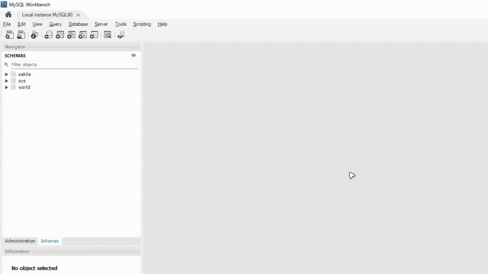
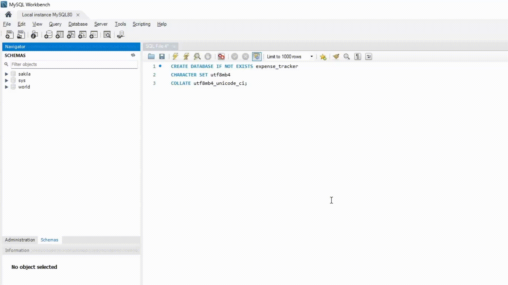

# MoneyFlow - Expense Tracker

MoneyFlow là ứng dụng quản lý chi tiêu cá nhân xây dựng bằng Django. Project hỗ trợ ghi nhận chi tiêu, phân loại, thống kê và hiển thị dashboard tổng quan theo thời gian.

README này hướng dẫn đầy đủ:

- cấu trúc thư mục project
- cách kết nối MySQL local
- cách chạy ứng dụng với dữ liệu rỗng hoặc dữ liệu mẫu
- Django được sử dụng như thế nào trong codebase

## 1. Yêu cầu

- Python 3.10+
- MySQL Server 8.x
- MySQL Workbench
- VS Code (khuyến nghị)

## 2. Cấu trúc thư mục project

```text
Expense_tracker/
|-- README.md
`-- expense_tracker/
		|-- .env
		|-- .gitignore
		|-- database.sql
		|-- database_hasdata.sql
		|-- manage.py
		|-- requirements.txt
		|-- settings.py
		|-- project_config/
		|   |-- __init__.py
		|   |-- asgi.py
		|   |-- settings.py
		|   |-- urls.py
		|   `-- wsgi.py
		`-- tracker/
				|-- __init__.py
				|-- admin.py
				|-- apps.py
				|-- context_processors.py
				|-- forms.py
				|-- models.py
				|-- tests.py
				|-- urls.py
				|-- views.py
				|-- migrations/
				|   |-- 0001_initial.py
				|   |-- 0002_expense_currency.py
				|   `-- 0003_usersettings.py
				|-- static/
				|   `-- tracker/
				|       `-- styles.css
				`-- templates/
						|-- base.html
						|-- registration/
						`-- tracker/
```

## 3. Ý nghĩa 2 file SQL

- `expense_tracker/database.sql`

  - Chỉ chứa schema: `CREATE TABLE`, index, constraints.
  - Không có `INSERT` dữ liệu mẫu.
- `expense_tracker/database_hasdata.sql`

  - Chứa schema + dữ liệu mẫu đầy đủ.
  - Có tài khoản demo và chi tiêu mẫu để test nhanh giao diện.

## 4. Cài đặt môi trường Python

Chạy tại thư mục gốc `Expense_tracker/`:

```powershell
python -m venv .venv
.\.venv\Scripts\Activate.ps1
pip install -r .\expense_tracker\requirements.txt
```

Nếu VS Code báo lỗi import thư viện, chọn đúng interpreter:

- `Ctrl+Shift+P` -> `Python: Select Interpreter`
- Chọn: `.venv\Scripts\python.exe`

## 5. Tạo database MySQL local

Mở MySQL Workbench và kết nối `Local instance MySQL80`, sau đó chạy:

```sql
CREATE DATABASE IF NOT EXISTS expense_tracker
CHARACTER SET utf8mb4
COLLATE utf8mb4_unicode_ci;
```



## 6. Cấu hình kết nối DB bằng `.env`

Sửa file `expense_tracker/.env`:

```env
DJANGO_SECRET_KEY=replace-with-a-secure-secret
DJANGO_DEBUG=True
DJANGO_ALLOWED_HOSTS=127.0.0.1,localhost

DB_NAME=expense_tracker
DB_USER=root
DB_PASSWORD=your_mysql_password
DB_HOST=127.0.0.1
DB_PORT=3306
```

## 7. Chạy app theo 2 kịch bản

### Kịch bản A: DB rỗng (không dữ liệu mẫu)

1. Import `expense_tracker/database.sql` vào MySQL Workbench.
2. Chạy các lệnh Django:

```powershell
cd .\expense_tracker
..\.venv\Scripts\python.exe manage.py migrate
..\.venv\Scripts\python.exe manage.py createsuperuser
..\.venv\Scripts\python.exe manage.py runserver
```

Sau đó, vào `[http://127.0.0.1:8000/](http://127.0.0.1:8000/)` để thực hiện đăng nhập với tài khoản và mật khẩu superuser mới tạo ở lệnh trên.

### Kịch bản B: DB có dữ liệu mẫu

1. Import `expense_tracker/database_hasdata.sql` vào MySQL Workbench.
2. Chạy server:

```powershell
cd .\expense_tracker
..\.venv\Scripts\python.exe manage.py runserver
```

Vào `[http://127.0.0.1:8000/](http://127.0.0.1:8000/)` để thực hiện đăng nhập với tài khoản demo (nếu chưa thay đổi trong dump):

- username: `admin`
- password: `admin`



## 8. Cách import SQL trong MySQL Workbench

1. Tạo schema `expense_tracker` (nếu chưa có).
2. `File` -> `Open SQL Script...`
3. Chọn file `database.sql` hoặc `database_hasdata.sql`
4. Bấm nút `Execute` (icon tia sét) để chạy toàn bộ script
5. Refresh `Schemas` để kiểm tra bảng

## 9. Kiểm tra nhanh sau khi import

```sql
USE expense_tracker;
SELECT COUNT(*) AS categories_count FROM expenses_category;
SELECT COUNT(*) AS expenses_count FROM expenses_expense;
SELECT COUNT(*) AS users_count FROM auth_user;
```

## 10. Django được sử dụng như thế nào trong project này

Project dùng Django theo mô hình MVT (Model - View - Template):

- Model

  - Nguồn: `expense_tracker/tracker/models.py`
  - Định nghĩa các bảng chính: `Category`, `Expense`, `UserSettings`.
  - Quan hệ: `Expense -> Category`, `Expense -> User`, `UserSettings -> User (OneToOne)`.
- Migration

  - Nguồn: `expense_tracker/tracker/migrations/`
  - Theo dõi thay đổi schema theo từng bước (`0001`, `0002`, `0003`).
  - Lệnh `manage.py migrate` dùng để đồng bộ schema DB theo code.
- View + URL

  - Nguồn: `expense_tracker/tracker/views.py`, `expense_tracker/tracker/urls.py`
  - Xử lý request/response, logic lọc dữ liệu, CRUD chi tiêu.
  - `project_config/urls.py` là điểm vào URL cấp project.
- Template + Static

  - Template: `expense_tracker/tracker/templates/`
  - Static files: `expense_tracker/tracker/static/tracker/styles.css`
  - Render UI thông qua Django Template Engine.
- Auth

  - Dùng `django.contrib.auth` cho login/logout và phân quyền user.
  - Dữ liệu user nằm trong bảng `auth_user`.
- Admin

  - Cấu hình tại `expense_tracker/tracker/admin.py`.
  - Có thể quản trị dữ liệu qua `/admin`.

## 11. Lỗi thường gặp

- `Access denied for user ...`

  - Kiểm tra `DB_USER`, `DB_PASSWORD` trong `expense_tracker/.env`.
  - Đảm bảo service MySQL đang chạy.
- `Import "dotenv" could not be resolved`

  - VS Code đang dùng sai interpreter.
  - Chọn lại `.venv\Scripts\python.exe`.
- Chạy được app nhưng không có dữ liệu

  - Thường do bạn import `database.sql` (schema-only).
  - Nếu muốn có dữ liệu demo, import `database_hasdata.sql`.
